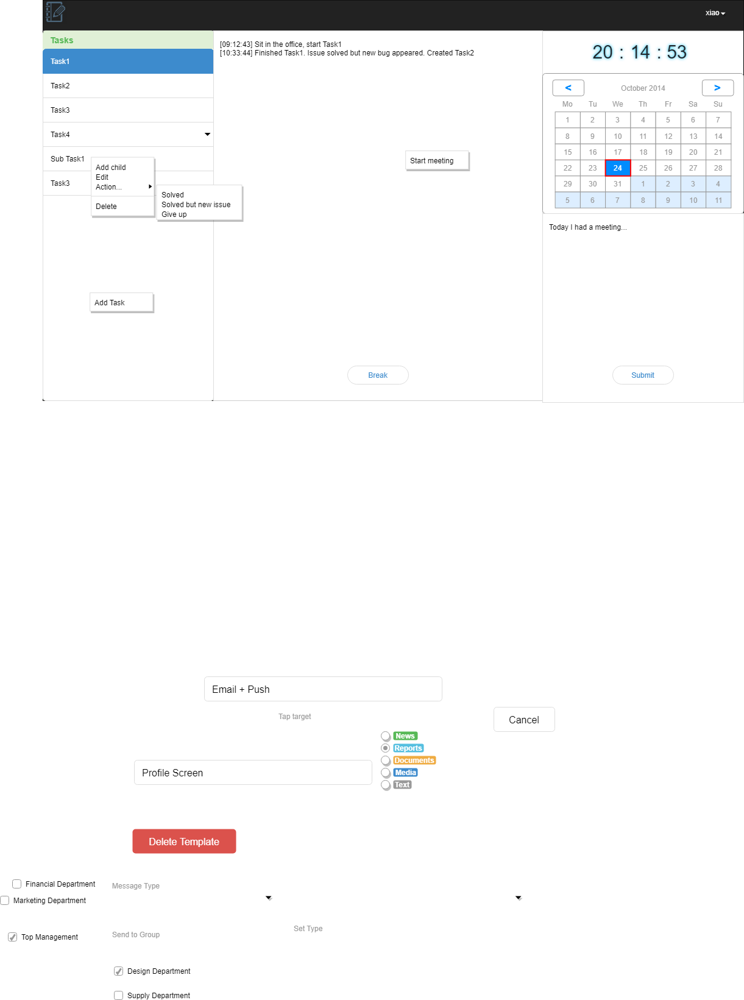

This is a a website hosting personal homepage and some web applications. This repo is mainly for my study of web development.

# Author
Xiao Zhang

# Architecture
This app is designed to track all the miscellaneous information during workdays. Therefore it has to record tasks, facilitates meeting notes and timestamp all the events. The architecture design follows temporal workflow of a day.

At the beginning of the workday, the user is prompted to select the scene of the day.

The main UI is designed as follows:

The **Add Task** dialog is designed:

The **Add Child** is similar but with a constraint that the child's importance cannot be higher than that of its parent's.

In the **Edit** dialog all the information can be modified.

One of the actions is chosen when the task is finished.

* Solved: mark the task as completed and prompted to start a new task. If the checkbox is checked, all the ui will be greyed out except the tasklist after the dialog is closed, until a task is selected.

  
* Solved but new issue: this task is solved but some new issues appeared during the process.

  
* Give up: this task is abandoned for some reason.

  

The **Delete**'s confirmation dialog is designed as:

