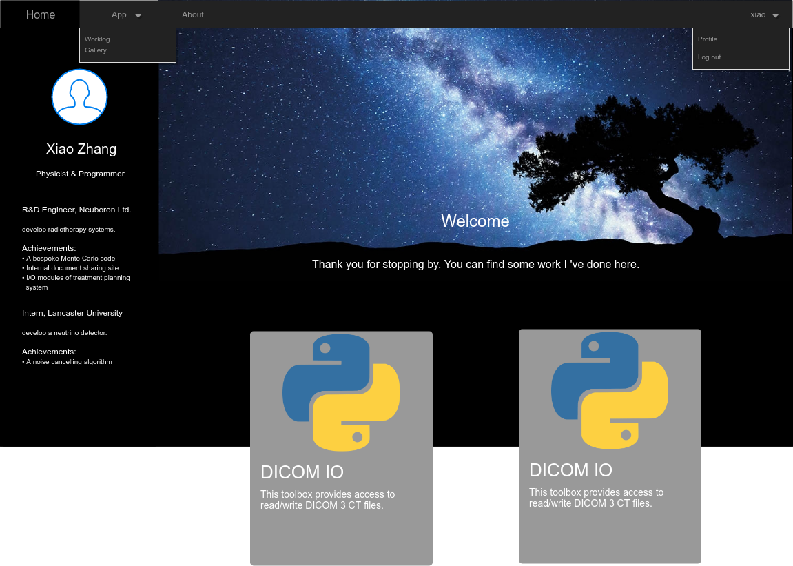
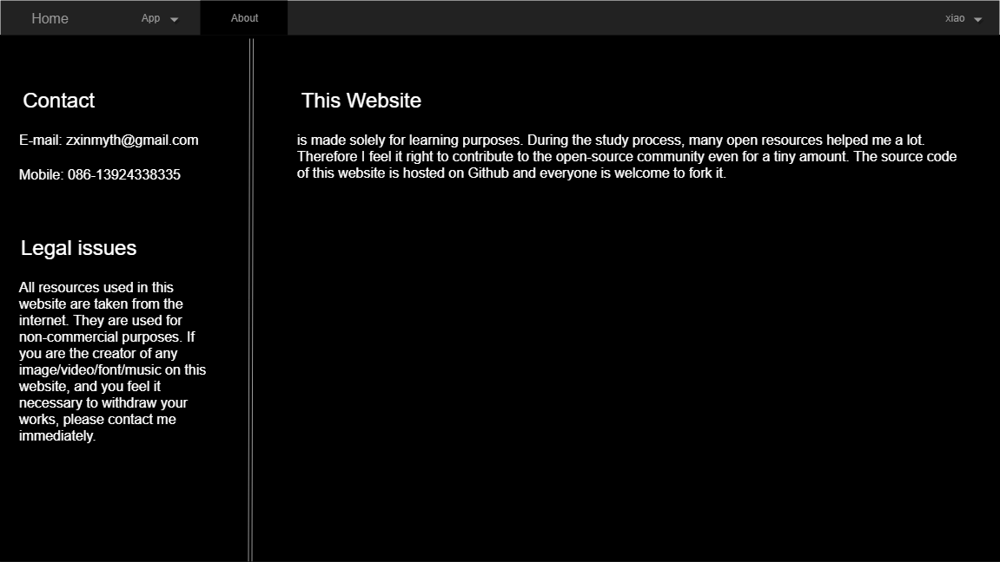

This is a a website hosting personal homepage and some web applications. This site is mainly for learning purpose

# Author
Xiao Zhang

# Design
The main function of this website is my personal homepage. For this purpose, the main UI is as follows:

The left panel is for my personal information. The static content include an avatar, name and title. These are grouped on the top half. The dynamic contents are my experiences. Each experience is grouped in 1 block. On collapse, only the title and the main objective are shown. On expansion, the achievements are shown. The dynamic part can scroll up and down.

The main part of the page is dyed dark. Below the welcome message is the showcase part. Each item is grouped into 1 card. 2 cards are aligned in 1 row. The background of the cards should also be black. The main part can be scrolled up and down as a whole.

Above all is navbar. The homepage is displayed above. The about page displays contact info and legal announcement of this website. The App tab should have its own page displaying all the apps hosted on this site.

On the far right of the navbar is the built-in auth service. The auth info is used across the entire site. If not authorised, it will display login button without dropdown. The profile page is for user account settings.

The logout button logs out the current user and returns the main page.

# Apps

This site is not only designed for showcasing myself, it is also made to facilitate my work by hosting web apps.

## Auth
/auth

### UI
The auth service stores the user information and provides access to it on requests. Therefore it needs to allow applications to register and users to authorise. The workflow follows:
1. applications register
2. users login
3. access granted/denied
For user login, the UI is:

For user registration, the UI is:

For app registration:

The basic design of the website contains 3 levels of permission. guest, user and pal. guest only has access to the public pages like about, resume and demo pages of the apps. user has additional access to apps. pal is able to invite other pals if more than 1/2 of the existing pals do not oppose. Therefore guests don't need to be authorised. users are open for registration. pal is only granted to people with invitation token.

The registration of user is completed on an email link. The app registration requires permission from the admin team(pal).

### Authentication && Authorisation
The user need to be authenticated to be able to use the apps. The auth service is a core service accessed from /oauth.

#### Registration
The apps needs to register with the auth service at installation to use the auth service. The app will provide a name, a mainpage url and a redirect url in exchange for a unique *aid* together with a unique secret string.

#### Authorisation

##### For the record
When a user browses the app without a valid authentication, a demo page is displayed. If the user clicks **Login**, he/she will be redirected to the login page for authorisation. The url is /oauth/authorise?response_type=code&client_id=aid&redirect_uri=callback&scope=read.
The user is then prompted to enter username and password to authorise the service. Once authorised, a code is generated indicating that the user is authorised to access the account. the redirect url is callback?code=code
Then the service receives the code and requests for an access token from the url /oauth/token?client_id=aid&client_secret=secret&grant_type=authorization_code&code=code&redirect_uri=callback
If the auth service verifies the code, a token in the form {access_token:token,token_type:bearer,expires_in:int,refresh_token:rtoken,scope:read,uid=int,info={name:string,email:string}} is generated and sent as the response to the service.

##### Default
When a user browses the app without a valid authentication, a demo page is displayed. If the user clicks **Login**, he/she will be redirected to the login page for authorisation. The url is /oauth/authorise?response_type=token&client_id=aid&redirect_uri=callback&scope=read.
The user is then prompted to enter username and password to authorise the service. Once authorised, a token is generated indicating that the user is authorised to access the account. The redirect url is redirect/callback#token=token.
The service then returns a script that extracts the token from the full url and receives it.
When the app receives the token, it uses the uid in the token as the owner field in the database, info.name as the username and email as the address to send notification mail.

### Data Structure
Based on the design, the service needs to have 2 unrelated SQL databases:
- user
  - id(INT)
  - name(TEXT)
  - password(TEXT)
  - level(INT)
  - email(TEXT)
- app
  - id
  - name
  - url
  - callback
  - secret

## Worklog
/app/worklog

### Logic & UI
This app is designed to track all the miscellaneous information during workdays. Therefore it has to record tasks, facilitates meeting notes and timestamp all the events. The architecture design follows temporal workflow of a day.

At the beginning of the workday, the user is prompted to select the scene of the day.

If either **in office** or **on business trip** is selected, the main UI shows up. In the meantime the user is prompted to select a task to begin with. The main UI is designed as follows:

The **Add Task** dialog is designed:

The **Add Child** is similar but with a constraint that the child's importance cannot be higher than that of its parent's.

In the **Edit** dialog all the information can be modified.

One of the actions is chosen when the task is finished.

* Solved: mark the task as completed and prompted to start a new task. If the checkbox is checked, all the ui will be greyed out except the tasklist after the dialog is closed, until a task is selected.

  
* Solved but new issue: this task is solved but some new issues appeared during the process.

  
* Give up: this task is abandoned for some reason.

  

The **Delete**'s confirmation dialog is designed as:

The **Start meeting** dialog is for recording meeting notes. Once clicked, the meeting dialog pops up. The user is then free to edit participants and agenda items. The items are discrete with no relationship. Each item is brought up by the presenter with a self-explainatory title. The conclusion is made at the end of the current item. When finished, the items will be grouped into 1 record and sent to the server. The log will need to be refreshed accordingly.

When the **Submit** button is clicked, the following dialog shows up. If the user chooses **Yes**, All changes made today will be submitted as confirmed with a short conclusive comment. In the server, the logs made today and the changes to the tasks will be committed.

When the **Break** button is clicked, the current task is paused and the tasklist is greyed out. A log stating the pause is created. The button itself changes to **Resume**.

If the user chooses **at home** at the beginning of the day, no tasks will be shown and the UI is solely for a record of the day.

### Data Structure
   There are 2 unrelated databases required in the design: task and log. The task can be stored as an SQL database as it has clear predefined structure whereas the log must be stored as a document per day in a NoSQL database. The design follows:
   
   - task
     - owner:int
     - title(TEXT)
     - description(TEXT)
     - importance(INT)
     - parent(INT)
     - status(INT)
     - created_at(TEXT)
     - closed_at(TEXT)
   - log
     - owner:int
     - date:string
     - begin_at:datetime
     - end_at:datetime
     - location:int
     - diary:{datetime:string}
   
   The database designed above is solely for the storage of the permanent data, i.e. committed changes. The temporary changes must be cached in another NoSQL database. Again, the cache database is divided into 2 collections for task and log separately.
   
   - task
     - owner:int
     - task_id:int
     - description:string
     - importance:int
     - status:int
     - parent:int
     - created_at:datetime
     - closed_at:datetime
   - log
     - owner:int
     - begin_at:datetime
     - end_at:datetime
     - location:int
     - diary:{datetime:string}
   
   At the end of the day, if authenticated, the changes saved in the cache database are committed to the permanent store. If not committed, the next time the user logs in, he/she will be prompted to finish the day then able to start a new day.
   
   Last of all, the access point of the data is /app/worklog/data. GET for the retrieval of data, POST for the submission of data. All the request are expected to be made by XmlHttpRequest. All the data transferred are enclosed in JSON string in the html body.

