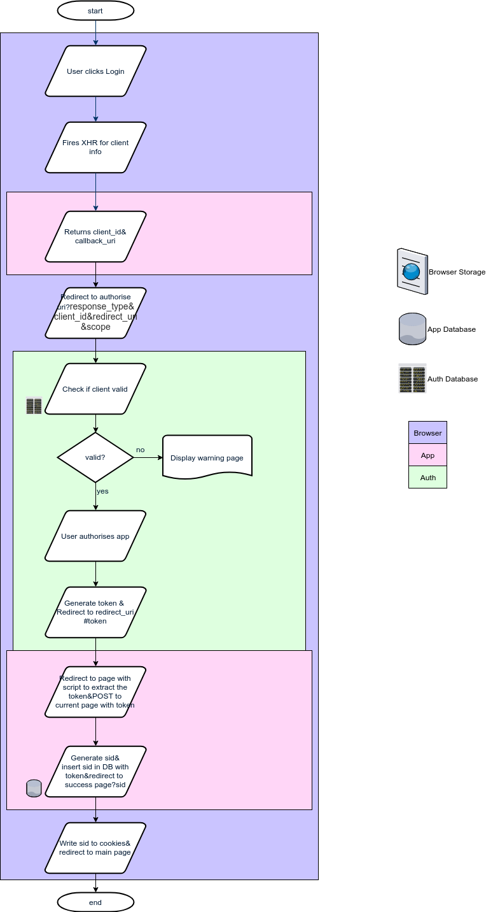

This is a a website hosting personal homepage and some web applications. This site is mainly for learning purpose

# Author
Xiao Zhang

# Design

The main function of this website is my personal homepage. For this purpose, the main UI is as follows:

The entire page is a React app by design. The main goal is to showcase myself.

The left panel is for my personal information. The static content include an avatar, name and title. These are grouped on the top half. The dynamic contents are my experiences. Each experience is grouped in 1 block. On collapse, only the title and the main objective are shown. On expansion, the achievements are shown. The dynamic part can scroll up and down. The data is retrieved from the local database.

The main part of the page is dyed dark. Below the welcome message is the showcase part. Each item is grouped into 1 card. 2 cards are aligned in 1 row. The background of the cards should also be black. The main part can be scrolled up and down as a whole while keeping the background image on the top complete. The data is retrieved from the local database.

Above all is navbar. The homepage is displayed above. The about page displays contact info and legal announcement of this website. The App tab should have its own page displaying all the apps hosted on this site.

On the far right of the navbar is the built-in auth service. The auth info is used across the entire site. If not authorised, it will display login button without dropdown. The profile page is for user account settings.

The logout button logs out the current user and redirects to the main page.

The whole structure is based on Server/Client architecture.

## Data Flow

The overall connection is show below

As shown above, the server only handles authentication/authorisation and registration. These tasks are all initiated not by the server but the client or directly by the user. Therefore the UI and data structure of the server is quite simple.

## Data Structure

The server needs to store and distribute user info on requests. Therefore it will need a database.
- user
  - **given\_name(TEXT):** real given name
  - **family\_name(TEXT):** real surname
  - **name\_order(INT):** 0: surname first; 1: given name first
  - **password(TEXT):** SHA3 hash of password
  - **active(INT):** 0: requires password reset; 1: normal state
  - **email(TEXT):** login name and main contact method
  - **creation\_date(TEXT):** the date of creation

As no user will be allowed to view or change others' data, no priviledge pyramid is implemented.

For app management, priviledge is introduced.
- app
  - **name(TEXT):** app name
  - **type(INT):** 0: web app; 1: native app
  - **callback(TEXT):** redirect uri
  - **secret(TEXT):** for identifying the app
  - **creator(INT):** id of creator
  - **priviledge(INT):** 0: read/write; 1: read

- user
  - **rowid(INT):** id of users with app-related priviledges
  - **level(INT):** 0: admin; 1: add/delete

For session management i.e. token management, no database is involved but all information is stored in the token itself by JWT with a shared key known only by the server. Therefore the server will extract the information directly from the access token for authorisation.

# Core Services

This site is not only designed for showcasing myself, it is also made to facilitate my work by hosting my own web apps.

## Auth
The most important service is the authentication service as many web apps hosted on the site requires user information.

### Data Structure
Based on the design, the service needs to have 1 SQL database with 4 tables:

#### auth

All columns above are NOT NULL.
- **user.rowid** is the uid of the user
- **user.name** is the preferred name of the user, preferrably real name.
- **user.password** is the hex representation hash of password of the user, the algorithm is SHA-3.
- **user.active** indicates whether the user is alive.
- **user.email** is the email of the user.
- **user.creation\_date** is the date of creation of the account in the default format of Date.toString
- **pri.rowid** is the uid of the user
- **pri.pri** is the priviledge level of the user. founder(0), admin(1), client(3)
- **app.rowid** is the cid of the app
- **app.name** is the title of the app
- **app.url** is the main page url of the app, not including the base url of this site or the trailing backslash
- **app.callback** is the base redirect url of the app where the user will be redirected when authenticated
- **app.secret** is the app's password in clear text. It is created by hashing the date using SHA-3
- **app.approval\_date** is the date on which the app is approved by an inspector
- **app.approved\_by** is the uid by which the app is approved. 
- **app.pri** is the priviledge of the app on the user info. read&write(0), read(1)
- **pend.name** is the same as **app.name**
- **pend.main\_uri** is the same as **app.main\_uri**
- **pend.redirect\_uri** is the same as **app.redirect\_uri**
- **pend.submission\_date** is the date on which the app's registration form was received
- **pend.submitted\_by** is the email of the applicant

### Data Flow
The workflow of authorization is token-based. The token is generated by auth server and stored by app server. In principle no 3rd party shall access the token. When the user opens the page of the app, the authentication process goes:

#### Authorisation
Now the tricky part comes. How is the app authorised? There are 2 most popular procedures.

##### code

##### Implicit

#### Authentication
The app can now be authorised. But how is the user authenticated?

#### Register
Both the user and app needs to be registered. The ui is designed as shown in the following section.

The user can be registered immediately. The app needs to be approved by users with certain permissions. Currently there are 3 levels of priviledges: founder(0), admin(1), client(3). only admin and founder can approve or deny applications.

Once the app is approved, it will be moved to the **app** table.

### Resources
Having the above design in mind, it is very clear now what functions the service needs to provide.
- **Register user** baseurl/newuser GET&POST
- **Register app** baseurl/newapp GET&POST
- **Delete user** baseurl/deluser POST
- **Delete app** baseurl/delapp POST
- **Activate user** baseurl/activate GET&POST
- **Approve app** baseurl/approv POST
- **Reset user** baseurl/resetuser POST
- **Request user** baseurl/request POST
- **Authenticate user** baseurl/authenticate GET&POST
- **Issue code** baseurl/authorize GET
- **Issue token** baseurl/token POST

### UI
The auth service stores the user information and provides access to it on requests. Therefore it needs to allow applications and users to register to be authenticated.

For user registration, the UI is:

For app registration:

For user to authorise app:

For admin(or above) to authorise an app registration:

For admin(or above) to manage apps and users:

For admin(or above) to manage users:

For admin(or above) to manage apps:

# Apps

## Worklog
/app/worklog

### Logic & UI
This app is designed to track all the miscellaneous information during workdays. Therefore it has to record tasks, facilitates meeting notes and timestamp all the events. The architecture design follows temporal workflow of a day.

At the beginning of the workday, the user is prompted to select the scene of the day.

If either **in office** or **on business trip** is selected, the main UI shows up. In the meantime the user is prompted to select a task to begin with. The main UI is designed as follows:

The **Add Task** dialog is designed:

The **Add Child** is similar but with a constraint that the child's importance cannot be higher than that of its parent's.

In the **Edit** dialog all the information can be modified.

One of the actions is chosen when the task is finished.

* Solved: mark the task as completed and prompted to start a new task. If the checkbox is checked, all the ui will be greyed out except the tasklist after the dialog is closed, until a task is selected.

  
* Solved but new issue: this task is solved but some new issues appeared during the process.

  
* Give up: this task is abandoned for some reason.

  

The **Delete**'s confirmation dialog is designed as:

The **Start meeting** dialog is for recording meeting notes. Once clicked, the meeting dialog pops up. The user is then free to edit participants and agenda items. The items are discrete with no relationship. Each item is brought up by the presenter with a self-explainatory title. The conclusion is made at the end of the current item. When finished, the items will be grouped into 1 record and sent to the server. The log will need to be refreshed accordingly.

When the **Submit** button is clicked, the following dialog shows up. If the user chooses **Yes**, All changes made today will be submitted as confirmed with a short conclusive comment. In the server, the logs made today and the changes to the tasks will be committed.

When the **Break** button is clicked, the current task is paused and the tasklist is greyed out. A log stating the pause is created. The button itself changes to **Resume**.

If the user chooses **at home** at the beginning of the day, no tasks will be shown and the UI is solely for a record of the day.

### Data Structure
   There are 2 unrelated databases required in the design: task and log. The task can be stored as an SQL database as it has clear predefined structure whereas the log must be stored as a document per day in a NoSQL database. The design follows:
   
   - task
     - owner:int
     - title(TEXT)
     - description(TEXT)
     - importance(INT)
     - parent(INT)
     - status(INT)
     - created_at(TEXT)
     - closed_at(TEXT)
   - log
     - owner:int
     - date:string
     - begin_at:datetime
     - end_at:datetime
     - location:int
     - diary:{datetime:string}
   
   The database designed above is solely for the storage of the permanent data, i.e. committed changes. The temporary changes must be cached in another NoSQL database. Again, the cache database is divided into 2 collections for task and log separately.
   
   - task
     - owner:int
     - task_id:int
     - description:string
     - importance:int
     - status:int
     - parent:int
     - created_at:datetime
     - closed_at:datetime
   - log
     - owner:int
     - begin_at:datetime
     - end_at:datetime
     - location:int
     - diary:{datetime:string}
   
   At the end of the day, if authenticated, the changes saved in the cache database are committed to the permanent store. If not committed, the next time the user logs in, he/she will be prompted to finish the day then able to start a new day.
   
   Last of all, the access point of the data is /app/worklog/data. GET for the retrieval of data, POST for the submission of data. All the request are expected to be made by XmlHttpRequest. All the data transferred are enclosed in JSON string in the html body.

