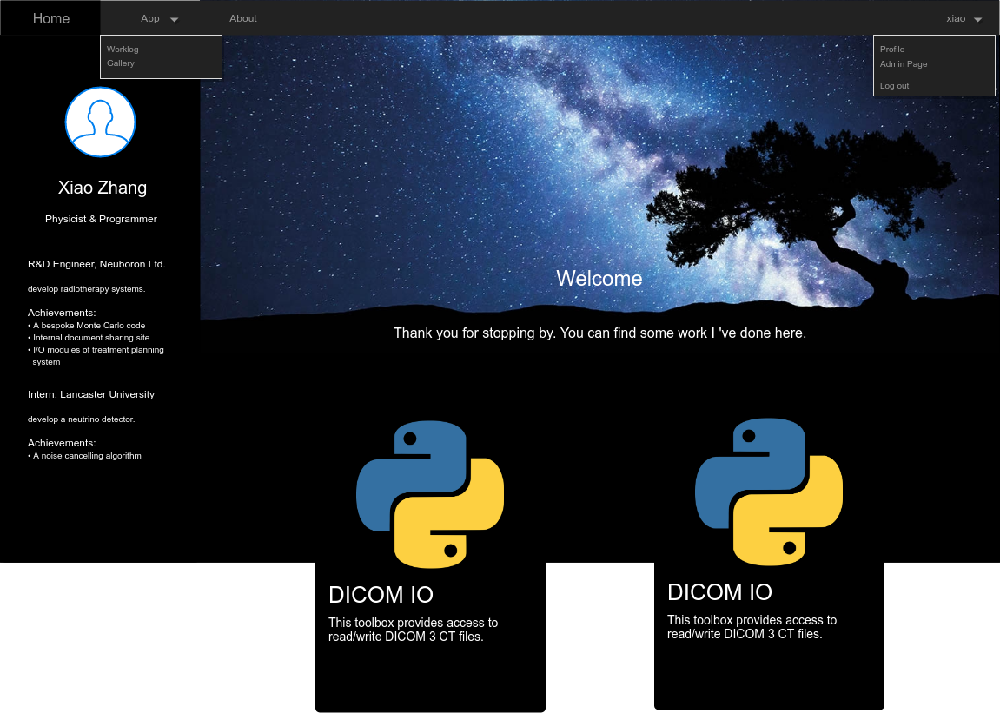
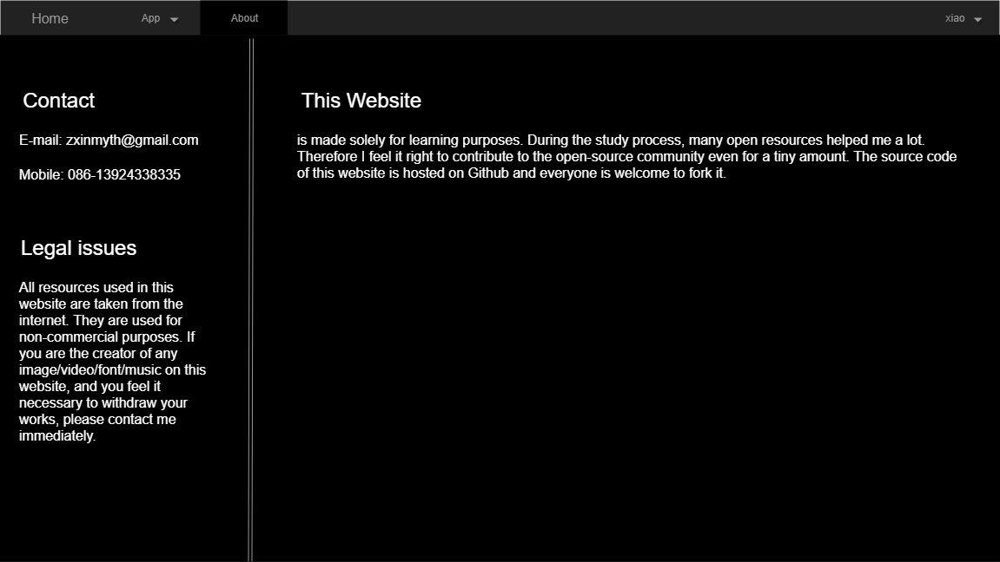
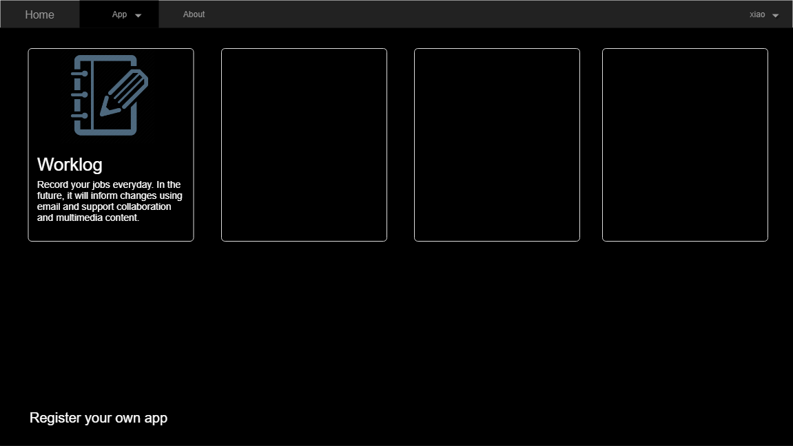
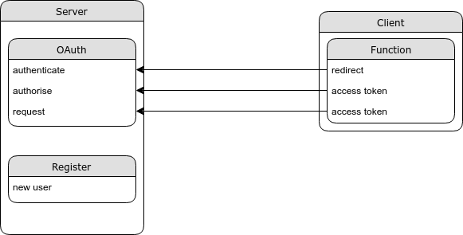
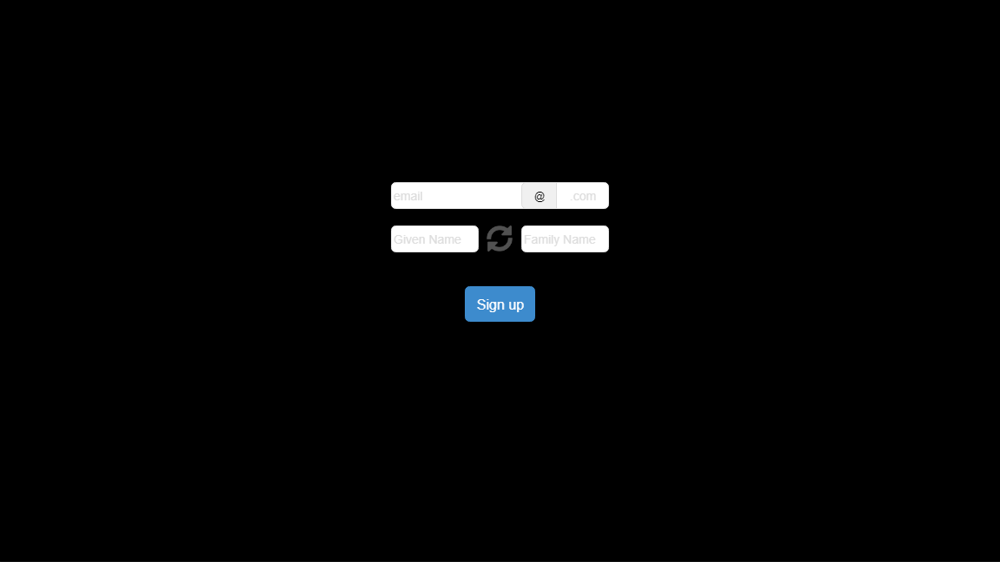

This is a a website hosting personal data and app data. This site is mainly for learning purpose

# Author
Xiao Zhang

# Design
The main function of this website is my personal homepage.

# UI
The homepage is shown below.

The left panel is for my personal information. The static content include an avatar, name and title. These are grouped on the top half. The dynamic contents are my experiences. Each experience is grouped in 1 block. On collapse, only the title and the main objective are shown. On expansion, the achievements are shown. The dynamic part can scroll up and down.

The main part of the page is dyed dark. Below the welcome message is the showcase part. Each item is grouped into 1 card. 2 cards are aligned in 1 row. The background of the cards should also be black. The main part can be scrolled up and down as a whole.

Above all is navbar. The homepage is displayed above. The about page displays contact info and legal announcement of this website. The App tab should have its own page displaying all the apps hosted on this site.

The homepage mainly serves 3 static pages. Home being the above, About below and App in the end of this section.

The components in home and about pages are served statically but the app page is dynamically displayed.
## Data Flow

The overall connection is show below

As shown above, the server only handles authentication/authorisation and registration. These tasks are all initiated not by the server but the client or directly by the user. Therefore the UI and data structure of the server is quite simple.

## Data Structure

The server needs to store and distribute user info on requests. Therefore it will need a database.
- user
  - **given\_name(TEXT):** real given name
  - **family\_name(TEXT):** real surname
  - **name\_order(INT):** 0: surname first; 1: given name first
  - **password(TEXT):** SHA3 hash of password
  - **active(INT):** 0: requires password reset; 1: normal state
  - **email(TEXT):** login name and main contact method
  - **creation\_date(TEXT):** the date of creation

As no user will be allowed to view or change others' data, no priviledge pyramid is implemented.

For app management, priviledge is introduced.
- app
  - **name(TEXT):** app name
  - **type(INT):** 0: web app; 1: native app
  - **callback(TEXT):** redirect uri
  - **secret(TEXT):** for identifying the app
  - **creator(INT):** id of creator
  - **priviledge(INT):** 0: read/write; 1: read

- appadmin
  - **rowid(INT):** id of users with app-related priviledges
  - **level(INT):** 0: admin; 1: add/delete

For session management i.e. token management, no database is involved but all information is stored in the token itself by JWT with a shared key known only by the server. Therefore the server will extract the information directly from the access token for authorisation.

Note: the priviledge in the app table only means the maximum permission the app has on the logged-in user's data. The app cannot access any user's data without authorised by the data owner.

## UI

The server only needs to host webpages for user registration. The modification and deletion are handled by apps. App registration and user priviledge in app database are handled by apps as well. The first registered user is defaulted to have the maximum permission in all tables. At the time of the first user's activation, the user is requested to register an app with read/write access to user information before the activation is complete.

Therefore the server needs to serve the user registration page.

After the registration the user is created in the user table with an activation string(SHA3 hash of current date) created and stored in the password field. In the meantime the user receives an email withe the activation uri. On click, the server executes post creation process if validated.
1. prompt the user to enter password
2. submit the password after passing validation
3. substitute the password field in the user table with the SHA3 hash of the new password
4. (if it is the first user created, ) prompt the user to register an app then add the user in appadmin table with level 0

On authentication requests, the server needs to serve the login page according to OAuth2 standard.

The server is created using Pug with express as the backend.

## Resources

- **Register user** /newuser GET&POST
- **Register app** /newapp POST
- **Delete user** /deluser POST
- **Delete app** /delapp POST
- **Reset user** /resetuser POST
- **Request user** /request POST
- **Issue code** /authorize GET
